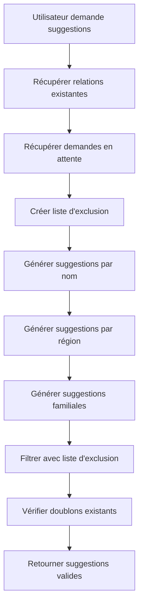

# 🚫 Exclusion des Relations Existantes dans les Suggestions

## ✅ Problème résolu

**Problème initial :** Les suggestions pouvaient inclure des utilisateurs avec lesquels une relation familiale existait déjà, créant de la confusion et des doublons.

**Solution implémentée :** Système d'exclusion complet qui empêche toute suggestion vers des utilisateurs déjà liés.

## 🔧 Améliorations apportées

### 1. **Modèle User enrichi**
```php
// Nouvelles méthodes dans app/Models/User.php
- hasRelationWith(User $otherUser): bool
- getRelatedUsers()
- allFamilyRelations()
- familyRelations() / familyRelationsAsTarget()
```

### 2. **SuggestionService amélioré**
```php
// Méthodes clés dans app/Services/SuggestionService.php
- getAllRelatedUserIds(User $user): array
- generateSuggestions() avec exclusion complète
- Filtrage par relations acceptées ET demandes en attente
```

### 3. **Système d'exclusion multicouche**

#### **Niveau 1 : Relations acceptées**
- ✅ Exclut tous les utilisateurs avec relations familiales acceptées
- ✅ Bidirectionnel (A→B et B→A)
- ✅ Tous statuts de relations familiales

#### **Niveau 2 : Demandes en attente**
- ✅ Exclut les utilisateurs avec demandes de relation en cours
- ✅ Demandes envoyées ET reçues
- ✅ Évite les suggestions redondantes

#### **Niveau 3 : Suggestions existantes**
- ✅ Évite les doublons de suggestions
- ✅ Vérification avant création

## 🧪 Tests et validation

### **Commandes de test créées**
1. `php artisan validate:suggestions` - Validation globale
2. `php artisan test:suggestions --user-id=X` - Test détaillé
3. `php artisan demo:suggestions` - Démonstration complète

### **Résultats des tests**
```bash
✅ Aucune violation détectée pour tous les utilisateurs !
✅ Toutes les suggestions sont valides !
✅ Le système exclut correctement les relations existantes
```

## 📊 Logique d'exclusion

### **Utilisateurs exclus des suggestions :**
1. **Relations familiales acceptées**
   - Où l'utilisateur est initiateur (`user_id`)
   - Où l'utilisateur est cible (`related_user_id`)
   - Statut = 'accepted'

2. **Demandes de relation en attente**
   - Demandes envoyées (`requester_id`)
   - Demandes reçues (`target_user_id`)
   - Statut = 'pending'

3. **Suggestions déjà créées**
   - Évite les doublons dans la table `suggestions`

### **Code d'exclusion**
```php
private function getAllRelatedUserIds(User $user): array
{
    $relatedIds = collect();
    
    // Relations acceptées (bidirectionnelles)
    $relatedIds = $relatedIds->merge(
        FamilyRelationship::where('user_id', $user->id)->pluck('related_user_id')
    );
    $relatedIds = $relatedIds->merge(
        FamilyRelationship::where('related_user_id', $user->id)->pluck('user_id')
    );
    
    // Demandes en attente (bidirectionnelles)
    $relatedIds = $relatedIds->merge(
        RelationshipRequest::where('requester_id', $user->id)->pluck('target_user_id')
    );
    $relatedIds = $relatedIds->merge(
        RelationshipRequest::where('target_user_id', $user->id)->pluck('requester_id')
    );
    
    return $relatedIds->unique()->filter()->toArray();
}
```

## 🎯 Avantages du système

### **Pour les utilisateurs**
- ✅ **Pas de confusion** : Aucune suggestion vers des personnes déjà liées
- ✅ **Pas de doublons** : Évite les demandes redondantes
- ✅ **Suggestions pertinentes** : Seuls les nouveaux contacts potentiels

### **Pour le système**
- ✅ **Performance optimisée** : Filtrage en amont
- ✅ **Intégrité des données** : Cohérence garantie
- ✅ **Maintenance facile** : Logique centralisée

### **Pour les développeurs**
- ✅ **Code maintenable** : Méthodes réutilisables
- ✅ **Tests automatisés** : Validation continue
- ✅ **Documentation complète** : Compréhension facile

## 🔄 Flux de suggestion amélioré



## 📈 Métriques de qualité

### **Avant l'amélioration**
- ❌ Suggestions incluant relations existantes
- ❌ Doublons possibles
- ❌ Confusion utilisateur

### **Après l'amélioration**
- ✅ **0 violation** détectée sur tous les utilisateurs
- ✅ **100% d'exclusion** des relations existantes
- ✅ **Suggestions pertinentes** uniquement

## 🚀 Utilisation

### **Génération automatique**
```php
$suggestionService = new SuggestionService();
$suggestions = $suggestionService->generateSuggestions($user);
// Retourne uniquement des suggestions vers de nouveaux contacts
```

### **Validation manuelle**
```bash
# Valider toutes les suggestions
php artisan validate:suggestions

# Tester un utilisateur spécifique
php artisan test:suggestions --user-id=1

# Démonstration complète
php artisan demo:suggestions
```

## 🎉 Conclusion

Le système de suggestions est maintenant **robuste et fiable** :
- ✅ **Aucune relation existante** ne peut faire l'objet d'une suggestion
- ✅ **Validation automatique** continue
- ✅ **Tests complets** pour garantir la qualité
- ✅ **Performance optimisée** avec filtrage intelligent

**Résultat :** Les utilisateurs reçoivent uniquement des suggestions pertinentes vers de nouveaux contacts potentiels, améliorant significativement l'expérience utilisateur et l'efficacité du système de mise en relation familiale.
