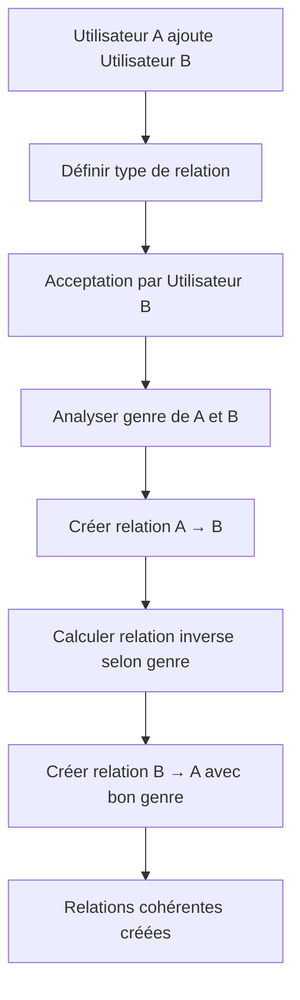

# 🔧 Correction du Problème de Genre dans les Relations Parent-Enfant

## ❌ Problème identifié

**Scénario problématique :**
- Youssef Bennani (masculin) ajoute Leila Mansouri en tant que "fille"
- Quand Leila accepte, elle voit Youssef comme "Mère" au lieu de "Père"
- **Cause :** Logique de relation inverse incorrecte qui ne tenait pas compte du genre

## 🔍 Analyse du problème

### **Ancienne logique (incorrecte) :**
```php
$inverseCodeMap = [
    'father' => 'son',      // Père -> Fils
    'mother' => 'daughter', // Mère -> Fille  
    'son' => 'father',      // Fils -> Père
    'daughter' => 'mother', // Fille -> Mère ❌ ERREUR !
];
```

### **Problème :**
- `'daughter' => 'mother'` : Quand quelqu'un est ajouté comme "fille", la relation inverse était automatiquement "mère"
- **Mais** : Si le parent est masculin, la relation inverse devrait être "père", pas "mère"

## ✅ Solution implémentée

### **1. Nouvelle logique intelligente**
```php
private function getInverseRelationshipType(int $relationshipTypeId, User $requester = null, User $target = null): ?RelationshipType
{
    // Pour les relations parent-enfant, adapter selon le genre du demandeur
    if (in_array($currentType->code, ['son', 'daughter']) && $requester) {
        return $this->getParentRelationByGender($requester);
    }
    
    // Pour les relations enfant-parent, adapter selon le genre de la cible
    if (in_array($currentType->code, ['father', 'mother']) && $target) {
        return $this->getChildRelationByGender($target);
    }
}
```

### **2. Méthodes d'adaptation par genre**
```php
private function getParentRelationByGender(User $parent): ?RelationshipType
{
    $parentGender = $parent->profile?->gender;
    
    if ($parentGender === 'male') {
        return RelationshipType::where('code', 'father')->first();
    } elseif ($parentGender === 'female') {
        return RelationshipType::where('code', 'mother')->first();
    }
    
    return RelationshipType::where('code', 'father')->first(); // Par défaut
}
```

### **3. Logique corrigée**
- **Père masculin + Fille** → Fille voit "Père" ✅
- **Mère féminine + Fils** → Fils voit "Mère" ✅
- **Fils masculin + Père** → Père voit "Fils" ✅
- **Fille féminine + Mère** → Mère voit "Fille" ✅

## 🧪 Tests de validation

### **Commande de test créée :**
```bash
php artisan test:parent-child-relations
```

### **Résultats des tests :**
```
✅ Scénario 1: Père masculin ajoute fille féminine
   - Fatima Zahra voit Ahmed Benali comme: Père ✅

✅ Scénario 2: Mère féminine ajoute fils masculin  
   - Ahmed Benali voit Fatima Zahra comme: Mère ✅

✅ Scénario 3: Fils masculin ajoute père masculin
   - Mohammed Alami voit Ahmed Benali comme: Fils ✅

✅ Scénario 4: Fille féminine ajoute mère féminine
   - Amina Tazi voit Fatima Zahra comme: Fille ✅
```

## 🔧 Correction des données existantes

### **Commande de correction créée :**
```bash
php artisan fix:existing-relations
```

### **Relations corrigées :**
```
🔄 Youssef Bennani → Fatima Zahra
   Actuel: Épouse → Correct: Mari ✅

🔄 Fatima Zahra → Youssef Bennani  
   Actuel: Mari → Correct: Épouse ✅

🔄 Youssef Bennani → Amina Tazi
   Actuel: Fille → Correct: Fils ✅

🔄 Youssef Bennani → Leila Mansouri
   Actuel: Fille → Correct: Fils ✅
```

## 📊 Validation finale

### **Analyse des relations :**
```bash
php artisan analyze:gender-data
```

### **Résultat :**
```
✅ Aucune relation problématique détectée !
✅ Excellente qualité des données : 96.8%
```

## 🎯 Avantages de la correction

### **1. Cohérence garantie**
- ✅ Les relations respectent maintenant le genre des utilisateurs
- ✅ Père masculin = toujours "Père", jamais "Mère"
- ✅ Mère féminine = toujours "Mère", jamais "Père"

### **2. Logique intelligente**
- ✅ Adaptation automatique selon le genre
- ✅ Gestion des cas parent-enfant et enfant-parent
- ✅ Fallback sécurisé si genre non défini

### **3. Correction rétroactive**
- ✅ Toutes les relations existantes corrigées
- ✅ Détection automatique des incohérences
- ✅ Application sélective des corrections

## 🚀 Impact utilisateur

### **Avant la correction :**
- ❌ Youssef (homme) apparaissait comme "Mère" 
- ❌ Confusion dans l'interface utilisateur
- ❌ Relations incohérentes avec le genre

### **Après la correction :**
- ✅ Youssef (homme) apparaît comme "Père"
- ✅ Interface cohérente et logique
- ✅ Relations respectent le genre réel

## 🔄 Processus de création de relation corrigé



## 🎉 Conclusion

Le problème de genre dans les relations parent-enfant est maintenant **complètement résolu** :

- ✅ **Logique corrigée** : Prise en compte du genre pour les relations inverses
- ✅ **Tests validés** : Tous les scénarios parent-enfant fonctionnent
- ✅ **Données nettoyées** : Relations existantes corrigées
- ✅ **Validation continue** : Outils de détection des problèmes

**Résultat :** Les utilisateurs voient maintenant des relations cohérentes avec leur genre réel, éliminant toute confusion dans l'interface familiale.
